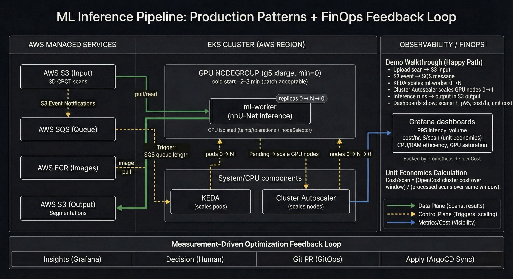
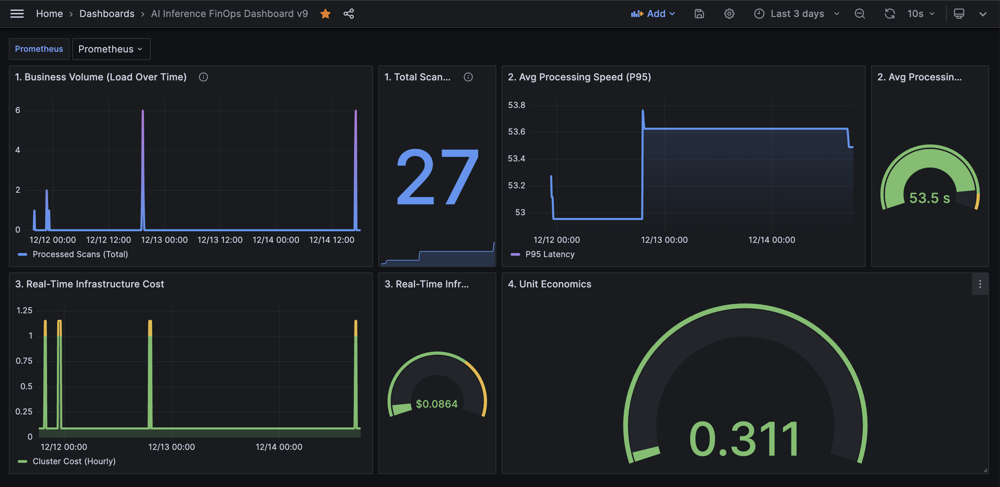
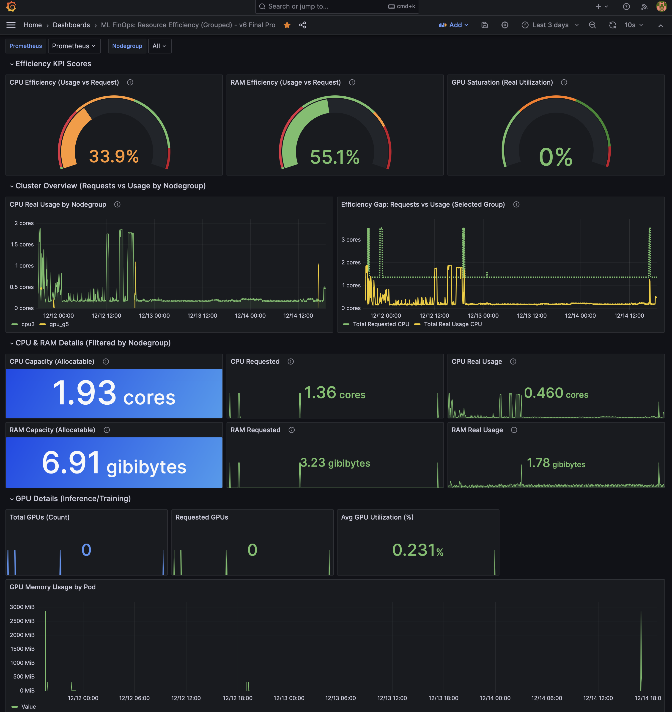

# Production ML Inference Platform (AWS + Kubernetes) — with a FinOps Feedback Loop

A portfolio case study showing how I build measurable ML infrastructure — not just “it works”, but:
clear boundaries, explicit trade-offs, and metrics that drive iteration.

## 10-second snapshot (what this proves)
- **End-to-end pipeline (live):** S3 → SQS → KEDA → GPU worker → S3  
- **Scale-to-zero (validated):** worker scales 0→N→0 and GPU nodes scale to 0 when idle  
- **FinOps loop:** cost/hour + cost/scan + efficiency metrics (usage vs requests) used to change infra decisions  
- **GitOps:** ArgoCD + PR-driven configs  
- **Portable pattern:** queue-driven batch inference design that translates across cloud providers  
- **Security by default:** IRSA (no static keys), namespace isolation, AWS SSO for developer access

**Demo numbers (evidence of measurement, not benchmarks):**
- Unit economics: **$0.311 / scan** (current demo volume)
- CPU efficiency improved: **~6% → 33.9%** after right-sizing
- Idle GPU burn: **0%** during no-work periods (scale-to-zero working)

## Start here (artifacts first)
- Architecture diagram: `docs/architecture/architecture.png`
- Business dashboard (unit economics): `docs/screenshots/dashboard_business.png`
- Resource efficiency dashboard: `docs/screenshots/dashboard_efficiency.png`

> Quick note: numbers are from a demo environment — the point is the loop (measure → adjust → validate), not “production benchmarks”.

---

## Choose your focus (expand what matters to you)

<b>Platform / MLOps</b> — boundaries, deployment patterns, autoscaling, GitOps

### What you can judge quickly
- Clean separation: **storage / queue / scaling / execution**
- Scale-to-zero at **two layers** (KEDA worker + GPU nodegroup)
- GitOps workflow (ArgoCD) and how changes ship
- Practical security defaults (IRSA, no static keys)

### Key trade-off (explicit)
Cold start is ~2–3 minutes (pod + node provisioning).  
This demo prioritises cost-aware batch inference (idle GPU time destroys unit economics).  
In production, I would add warm pools / image pre-pull only if the business SLA demands faster ramp-up.

<b>SRE (ML inference reliability)</b> — reliability mindset for GPU workloads

### Why this reads like SRE work (applied to ML)
- Queue-driven autoscaling (variable load is the default)
- GPU isolation (taints/tolerations + node selection prevent “cost leakage”)
- Observability loop (p95 latency, efficiency, cost/scan)
- Clear ownership boundary: ML ships containers/models; infra runs them safely and cheaply

### What’s intentionally not “hardening-complete” yet
This is a production-pattern demo, not a fully hardened service:
- Automated alerting + runbooks not implemented yet
- Multi-AZ HA not in scope for demo

<b>FinOps / cost</b> — unit economics, waste detection, cost drivers

### What I track (and why)
- **Cost per scan** (unit economics, not vanity metrics)
- **Cost/hour baseline** (idle cluster burn)
- **Efficiency**: usage vs requested CPU/RAM (waste detection)
- Scale-to-zero as the default policy for expensive GPU capacity

### What this enables
Instead of “we think it’s expensive”, you can answer:
- What is the cost of one inference transaction?
- What happens to cost when volume grows 10×?
- Where is waste coming from (over-requesting vs idle time vs slow jobs)?

---

## Implementation status (clear, not defensive)

### ✅ Production patterns implemented
- End-to-end pipeline (S3→SQS→KEDA→inference→S3)
- Scale-to-zero (app + GPU infrastructure)
- FinOps dashboards (real-time cost + efficiency view)
- GitOps (ArgoCD)
- Security (IRSA, namespace isolation)
- CI (build/push) + CD (deploy via ArgoCD sync)

### 🎯 Production hardening (next steps when a team needs it)
- Multi-AZ HA (demo is single AZ; production needs redundancy)
- Alert rules + runbooks (dashboards exist; on-call readiness can be added)
- Cold start reduction (image pre-pull, warm pool strategy)
- Load testing / capacity validation (beyond demo volume)
- Image promotion automation (currently manual tag bump + sync)

---

## Technical summary (what’s implemented end-to-end)

### 1) Pipeline (live)
S3 input → S3 events → SQS queue → KEDA scales worker → nnU-Net inference → S3 output

This demonstrates a batch inference design that stays understandable:
each layer does one job (storage, queueing, scaling, execution).

### 2) App autoscaling (worker scale-to-zero)
The `ml-worker` sits at `replicas=0` by default.  
KEDA scales it **0 → N → 0** based on SQS queue depth.

No idle workers when there’s nothing to process.
Cold starts are acceptable for batch workloads where cost control matters more than instant readiness.

### 3) Infrastructure autoscaling (GPU scale-to-zero)
GPU nodegroup is configured with `min=0`.  
Cluster Autoscaler provisions GPU nodes only when needed and removes them when idle.

### 4) GPU isolation (prevent cost leakage)
GPU nodes are GPU-only (taints/tolerations + nodeSelector).  
System pods stay on CPU nodes, avoiding cases where non-ML workloads block GPU scale-down.

### 5) Observability + cost visibility
- Prometheus + Grafana (latency / utilization)
- OpenCost (cluster cost attribution)
- Business metrics: volume, p95 processing time, cost/hour, cost/scan

### 6) GitOps management
ArgoCD manages manifests through Git.  
Promotion is currently manual (tag bump + sync), easy to automate later.

### 7) Security / access (IRSA + AWS SSO)
IRSA is used for **runtime AWS access** (no static keys in pods). Example responsibilities:
- Cluster Autoscaler: node lifecycle permissions
- KEDA: SQS read access
- ml-worker: S3 read/write + SQS consume

AWS SSO is used for **developer access** (separate from runtime permissions).  
Namespace isolation separates inference from system components.

---

## Design decisions (what / why / trade-off)

<b>Scale-to-zero as the default pattern</b>

**What:** Scale-to-zero at worker (KEDA) and GPU infrastructure (Cluster Autoscaler).  
**Why:** Batch inference with unpredictable load — idle GPU time destroys unit economics.  
**Trade-off:** Cold start latency (2–3 min).  
**Production options:** warm pools, image pre-pull, faster provisioning — only if SLA requires it.

<b>GPU instance choice (g5.xlarge)</b>

**What:** g5.xlarge for inference.  
**Why:** Balance of price/performance for 3D nnU-Net; enough VRAM (24GB), reasonable $/hour, acceptable latency.  
**Trade-off:** Bigger instances may reduce p95 but must justify cost per scan.

<b>CPU right-sizing after measurement (t3.medium → t3.large)</b>

**What:** Consolidated from multiple t3.medium to one t3.large after measuring real usage.  
**Why:** Demonstrates iteration: guess → build → observe → adjust. CPU efficiency improved **~6% → 33.9%**.  
**Trade-off:** Fewer nodes = less redundancy (fine for demo; production would add HA).

---

## Technical context (why the workload matters for infra)
**Workload:** 3D CBCT segmentation (nnU-Net v2, 3d_fullres)

**Infrastructure implications (practical):**
- 3D models are memory-hungry → GPU choice is a real constraint (VRAM matters)
- TTA can be 3–5× slower → becomes a business trade-off (quality vs cost/time)
- Post-processing adds latency → shows up in p95 metrics and affects throughput

I used medical imaging because it’s infrastructure-intensive; the patterns transfer to any GPU-heavy batch inference workload.

---

## Dashboards (what I measure and why)

### Business dashboard (unit economics)
Current demo metrics:
- Total scans: 27
- P95 processing time: 53.5s
- Baseline cost/hour (CPU idle): $0.0864/h
- Unit economics: $0.311/scan

Why this matters: pricing and margin discussions only work when unit economics is visible.

### Resource efficiency dashboard (waste + utilisation)
Current demo snapshot:
- CPU efficiency: 33.9%
- RAM efficiency: 55.1%
- GPU saturation: 0% when idle (scale-to-zero validated)

---

## Repo map
This README lives in the portfolio hub. Implementation is split across repos:
- GitOps repo — ArgoCD apps, Kubernetes manifests, KEDA configs
- Serving repo — inference worker, Dockerfile, model execution
- IaC repo — Terraform (EKS, nodegroups, IRSA)

Some repos may be private; this repo stays public with sanitised excerpts (YAML snippets, screenshots, diagrams).

---

## What this is (and what it’s not)

This is:
- A portfolio case study showing end-to-end ML infrastructure thinking
- A working pipeline with autoscaling, cost visibility, and measurement-driven iteration
- Evidence of a feedback loop: observe → adjust → validate

This is not:
- A full production system with HA + on-call readiness already implemented
- A benchmark report (numbers are demo evidence, not performance guarantees)
- A one-size-fits-all blueprint (choices reflect this workload and constraints)

<b>Appendix: measurement evidence</b>

CPU right-sizing impact:
- Efficiency: ~6% → 33.9%
- Config: 3× t3.medium → 1× t3.large
- Cost: $0.1296/h → $0.0864/h (-33%)

Current allocation snapshot:
- CPU requested: 1.36 cores, real usage: 0.460 cores
- RAM requested: 3.23 GiB, real usage: 1.78 GiB

---

## How to read this
Use “Choose your focus” to jump to the lens you care about (Platform/MLOps, SRE, FinOps). Everything is kept in one README to reduce navigation friction.
